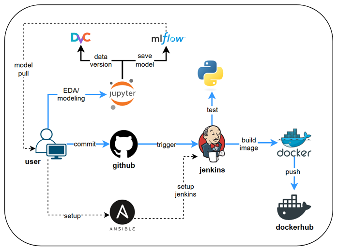

# Kidney Disease Classification

A comprehensive **MLOps pipeline demonstration** for kidney disease classification using deep learning and computer vision techniques. This project showcases the complete implementation of machine learning operations including automated data pipelines, model training, experiment tracking, and deployment preparation with modern web frontend integration.


### Live Demo: https://kidney-disease-classification-project.vercel.app/

## Architecture

### **Complete MLOps Pipeline**
- **Data Version Control (DVC)** for dataset and model versioning
- **MLflow** for experiment tracking, model registry, and lifecycle management
- **Automated CI/CD** with Jenkins pipeline configuration
- **Infrastructure as Code (IaC)** using Ansible for automated provisioning
- **Container Orchestration** with Docker and Docker Compose
- **Model Monitoring** and performance tracking in production
- **Frontend Integration** with Next.js for medical professionals


### **Technology Stack**

#### **MLOps & DevOps**
- **CI/CD**: Jenkins, GitHub Actions
- **Infrastructure**: Ansible, Docker, Docker Compose
- **Monitoring**: MLflow, DagsHub
- **Version Control**: Git, DVC

#### **Machine Learning**
- **Framework**: TensorFlow, Keras
- **Models**: VGG16, Custom CNN architectures
- **Tracking**: MLflow, DagsHub integration
- **Data**: Structured pipeline with validation and versioning

#### **Backend**
- **API**: FastAPI with async support
- **Architecture**: Clean code, OOP principles, dependency injection
- **Features**: Logging, custom exception handling, API documentation

#### **Frontend**
- **Framework**: Next.js 14 with TypeScript
- **Styling**: TailwindCSS, Shadcn.UI components
- **Features**: Responsive design, real-time predictions

## Dataset Information

### Context
CT KIDNEY DATASET: Normal-Cyst-Tumor and Stone

### Content
The dataset comprises 12,446 unique data points, including 3,709 cyst, 5,077 normal, 1,377 stone, and 2,283 tumor findings. It was collected from PACS from various hospitals in Dhaka, Bangladesh. After thorough selection and anonymization processes, the images were converted to a lossless jpg format and verified by medical professionals.

### Dataset Link: https://www.kaggle.com/datasets/nazmul0087/ct-kidney-dataset-normal-cyst-tumor-and-stone/data

## My dagshub and mlflow
You can track the progress and results of the training pipeline using Dagshub for version control, pipeline visualization, and collaboration.  
My dagshub: https://dagshub.com/TTNamUS/Kidney-Disease-Classification-Project

Detailed metrics, parameters, and artifacts are logged and can be explored through the MLflow UI.  
My mlflow: https://dagshub.com/TTNamUS/Kidney-Disease-Classification-Project.mlflow


---
# Getting Started

### Prerequisites
- [uv](https://github.com/astral-sh/uv) (Python package manager)
- Python 3.10+
- Node.js 20+
- Docker & Docker Compose (optional)

### Clone the Repository
```bash
git clone https://github.com/TTNamUS/Kidney-Disease-Classification-Project.git
cd Kidney-Disease-Classification-Project
```

## Running with Docker Compose (Recommended)

The easiest way to run both backend and frontend services:

```bash
# Build and start all services
docker-compose up --build

# Run in detached mode
docker-compose up -d --build

# Stop all services
docker-compose down
```

**Services will be available at:**
- Backend API: http://localhost:8000
- Frontend: http://localhost:3000

## Manual Setup

### Backend Setup

1. **Create Python Environment**
	```bash
	uv venv
	.venv\Scripts\activate  # On Windows
	# or
	source .venv/bin/activate  # On Linux/Mac
	```

2. **Install Dependencies**
   ```bash
   uv pip install -r requirements.txt
   ```

3. **Start Backend Server**
   ```bash
   # Direct execution
   uv run app.py
   
   # Using uvicorn
   uvicorn app:app --reload --port 8000
   ```

4. **Run Training Pipeline (Optional)**
   ```bash
   # Direct execution
   uv run main.py
   
   # Using DVC pipeline
   dvc init
   dvc repro
   dvc dag
   ```

5. **Launch MLflow UI (Optional)**
   ```bash
   mlflow ui
   ```

### Frontend Setup

1. **Navigate to Frontend Directory**
   ```bash
   cd frontend
   ```

2. **Install Dependencies**
   ```bash
   npm install
   ```

3. **Development Mode**
   ```bash
   npm run dev
   ```

**Access Points:**
- Backend API: http://localhost:8000
- Frontend: http://localhost:3000
- MLflow UI: http://localhost:5000

---
# Build CI/CD with Jenkins
## Jenkins Server Setup on Google Cloud VM

### Manual Approach

#### 1. Create a VM Instance on Google Cloud

- Go to [Google Cloud Console](https://console.cloud.google.com/).
- Navigate to **Compute Engine > VM instances**.
- Click **Create Instance**.
- Choose a name, region, machine type (e.g., e2-medium), and boot disk (Ubuntu recommended).
- Allow HTTP and HTTPS traffic.
- Click **Create**.

#### 2. SSH into the VM

Generate your SSH key first. Open your local terminal, type
```
ssh-keygen -t rsa -b 4096 -C "your_email@example.com"
```

To see and copy the content of the file `~/.ssh/id_rsa.pub`, use the cat command:
```
cat ~/.ssh/id_rsa.pub
```

Navigate to [METADATA](https://console.cloud.google.com/compute/metadata) and Select the tab SSH KEYS and add SSH Key (the content of your file `~/.ssh/id_rsa.pub`):

Note: If the Metadata tab contains the key `enable-oslogin=true`, then change it to `enable-oslogin=false`.


#### 3. Install Docker

```bash
sudo -i
apt update -y
apt install docker.io -y
systemctl start docker
systemctl enable docker
```

#### 4. Run Jenkins with Docker

```bash
docker run -d \
  --name jenkins \
  -p 8081:8080 \
  -p 50000:50000 \
  -v jenkins_home:/var/jenkins_home \
  jenkins/jenkins:lts
```

#### 5. Configure Firewall Rules

- Go to **VPC Network > Firewall** in Google Cloud Console.
- Click **Create Firewall Rule**.
- Name: `jenkins-allow`
- Targets: All instances in the network
- Source IP ranges: `0.0.0.0/0`
- Protocols and ports: Select **Specified protocols and ports**, then check `tcp:8081`
- Click **Create**.
---

### Automated Approach with Ansible

You can automate the Jenkins VM creation using **Ansible**.

#### Prerequisites
We can easily connect to GKE using the Gcloud CLI. Reading this guide to install [gcloud CLI](https://cloud.google.com/sdk/docs/install#deb) in local terminal gcloud CLI.

After that, initialize the gcloud CLI by typing `gcloud init`, then type "Y". Then you need to install the gke-gcloud-auth-plugin binary: `gcloud components install gke-gcloud-auth-plugin`.

- Create a [GCP service account](https://cloud.google.com/iam/docs/service-accounts-create) with `Compute Admin` permission.
- In the service account's Actions column, select **Manage keys**.
- Click **ADD KEY** → **Create new key** → **Create** and download the JSON file.
- Place the credentials JSON file under `/iac/ansible/secrets`.

Next create a Google Compute Engine instance named "jenkins-server" running Ubuntu 22.04 with a firewall rule allowing traffic on ports 8081 and 50000:
```bash
ansible-playbook iac/ansible/deploy_jenkins/create_compute_instance.yaml
```
> **Note:** Edit `create_compute_instance.yaml` to set your project id and service account (e.g., line 11 & 14, 43 & 45).

Deploy Jenkins on a server by installing prerequisites, pulling a Docker image, and creating a privileged container with access to the Docker socket and exposed ports 8081 and 50000:
```bash
ansible-playbook -i iac/ansible/inventory iac/ansible/deploy_jenkins/deploy_jenkins.yaml
```

## Access Jenkins
- Open web browser Jenkins UI through  
  `http://<YOUR_VM_EXTERNAL_IP>:8081`
- To get the initial admin password, run:
  ```bash
  docker exec jenkins cat /var/jenkins_home/secrets/initialAdminPassword
  ```
- Copy the password and paste it into the Jenkins setup page.

After entering the password, install the "set suggested plugin". 

### Install necessary plugins:
Navigate to Dashboard > Manage Jenkins > Plugins > Available plugin. And TYPE "Docker, Docker pipeline, gcloud SDK" on search bar. Then SELECT "Install without restart".

After installing the plugins, restart Jenkins.

```bash
sudo docker restart jenkins-server
```

### Configure Jenkins:

#### Add webhooks to your GitHub repository to trigger Jenkins builds.

Go to the GitHub repository and click on `Settings`. Click on `Webhooks` and then click on `Add Webhook`. Enter the URL of your Jenkins server (e.g. `http://<EXTERNAL_IP>:8081/github-webhook/`). Then click on `Let me select individual events` and select `Let me select individual events`. Select `Push` and `Pull Request` and click on `Add Webhook`.

#### Add Github repository as a Jenkins source code repository.

Go to Jenkins dashboard and click on `New Item`. Enter a name for your project and select `Multibranch Pipeline`. Click on `OK`. Click on `Configure` and then click on `Add Source`. Select `GitHub` and click on `Add`. Enter the URL of your GitHub repository. In the `Credentials` field, select `Add` and select `Username with password`. Enter your GitHub username and password (or use a personal access token). Click on `Test Connection` and then click on `Save`.

#### Setup docker hub credentials.

First, create a Docker Hub account. Go to the Docker Hub website and click on `Sign Up`. Enter your username and password. Click on `Sign Up`. Click on `Create Repository`. Enter a name for your repository and click on `Create`.

From Jenkins dashboard, go to `Manage Jenkins` > `Credentials`. Click on `Add Credentials`. Select `Username with password` and click on `Add`. Enter your Docker Hub username, access token, and set `ID` to `dockerhub`.

#### Test the setup:

Push a new commit to your GitHub repository. You should see a new build in Jenkins.


## 🚀 Future Work & Roadmap

### **Kubernetes Orchestration**
- [ ] **Kubernetes Deployment**: Migrate from Docker Compose to Kubernetes for better scalability
- [ ] **Helm Charts**: Create Helm charts for simplified Kubernetes deployments
- [ ] **Auto-scaling**: Implement Horizontal Pod Autoscaler (HPA) based on CPU/memory metrics
- [ ] **Service Mesh**: Integrate Istio for advanced traffic management and security
- [ ] **Config Management**: Use ConfigMaps and Secrets for environment-specific configurations

### **Advanced Monitoring & Observability**
- [ ] **Grafana Dashboards**: Create comprehensive monitoring dashboards for:
  - Model performance metrics
  - API response times and throughput
  - Infrastructure resource utilization
  - Business KPIs (prediction accuracy, user engagement)
- [ ] **Prometheus Integration**: Set up metrics collection and alerting
- [ ] **Jaeger Tracing**: Implement distributed tracing for request tracking
- [ ] **Model Drift Detection**: Real-time monitoring for data and concept drift
- [ ] **A/B Testing Framework**: Compare model versions in production

### **Centralized Logging**
- [ ] **ELK Stack**: Deploy Elasticsearch, Logstash, and Kibana for log aggregation
- [ ] **Structured Logging**: Implement JSON-based logging with correlation IDs
- [ ] **Log Analytics**: Create dashboards for error tracking and performance analysis
- [ ] **Alert Management**: Set up log-based alerting for critical errors

### **Multi-Cloud Deployment**

#### **Google Cloud Platform (GCP)**
- [ ] **GKE Deployment**: Deploy to Google Kubernetes Engine
- [ ] **Cloud Storage**: Use GCS for model artifacts and data storage
- [ ] **Cloud Build**: Integrate with GCP CI/CD pipelines
- [ ] **Vertex AI**: Leverage managed ML services for training and serving
- [ ] **Cloud Monitoring**: Implement GCP-native monitoring solutions

#### **Amazon Web Services (AWS)**
- [ ] **EKS Deployment**: Deploy to Amazon Elastic Kubernetes Service
- [ ] **S3 Integration**: Use S3 for data lake and model registry
- [ ] **SageMaker**: Integrate with AWS managed ML platform
- [ ] **CloudWatch**: Implement AWS-native monitoring and logging
- [ ] **Lambda Functions**: Serverless inference endpoints

#### **Microsoft Azure**
- [ ] **AKS Deployment**: Deploy to Azure Kubernetes Service
- [ ] **Azure ML**: Integrate with Azure Machine Learning platform
- [ ] **Blob Storage**: Use Azure Storage for data and artifacts
- [ ] **Application Insights**: Implement Azure monitoring solutions
- [ ] **Azure Functions**: Serverless computing for inference

### **Enhanced MLOps Capabilities**

#### **Advanced Model Management**
- [ ] **Model Registry**: Implement centralized model versioning and metadata management
- [ ] **Automated Retraining**: Set up scheduled model retraining pipelines
- [ ] **Champion/Challenger**: Implement automated model comparison and promotion
- [ ] **Feature Store**: Build centralized feature management and serving
- [ ] **Data Validation**: Implement comprehensive data quality checks

#### **Security & Compliance**
- [ ] **RBAC Implementation**: Role-based access control for ML pipelines
- [ ] **Secrets Management**: Integrate with HashiCorp Vault or cloud secret managers
- [ ] **Data Encryption**: End-to-end encryption for data at rest and in transit
- [ ] **Audit Logging**: Comprehensive audit trails for model deployments
- [ ] **GDPR Compliance**: Implement data privacy and right-to-be-forgotten features

#### **Performance Optimization**
- [ ] **Model Optimization**: TensorRT, ONNX, or TensorFlow Lite for faster inference
- [ ] **Caching Layer**: Redis/Memcached for prediction caching
- [ ] **Load Balancing**: Advanced load balancing strategies for high availability
- [ ] **Edge Deployment**: Deploy models to edge devices for offline inference
- [ ] **Batch Inference**: Implement batch prediction pipelines

### **Advanced Analytics & Business Intelligence**
- [ ] **Real-time Analytics**: Stream processing with Apache Kafka/Flink
- [ ] **Data Warehouse**: BigQuery/Snowflake for analytical workloads
- [ ] **Business Dashboards**: Executive-level KPI dashboards
- [ ] **Predictive Analytics**: Forecasting for resource planning and capacity management

### **Integration & API Enhancements**
- [ ] **GraphQL API**: Implement GraphQL for flexible data querying
- [ ] **Webhooks**: Event-driven notifications for model predictions
- [ ] **Third-party Integrations**: FHIR compliance for healthcare systems
- [ ] **Mobile SDK**: Native mobile SDKs for iOS and Android
- [ ] **API Gateway**: Implement rate limiting, authentication, and routing

### **Development & Collaboration**
- [ ] **GitOps**: Implement GitOps workflows with ArgoCD or Flux
- [ ] **Code Quality**: SonarQube integration for code analysis
- [ ] **Documentation**: Auto-generated API documentation and architecture diagrams
- [ ] **Developer Portal**: Self-service platform for ML engineers and data scientists


## References
- https://github.com/krishnaik06/Kidney-Disease-Classification-Deep-Learning-Project
- https://github.com/Youssef22Ashraf/kidney_Disease-Classification-project


---


Developed end-to-end MLOps pipeline for medical image classification to classify kidney disease with comprehensive experiment tracking via MLflow and automated CI/CD using Jenkins and Ansible for infrastructure provisioning.

The project featured clear and structured stages from data preprocessing, model training, experiment tracking, and deployment preparation with modern web frontend integration.

Tools Used: Python, TensorFlow, DVC, MLflow, DagsHub, FastAPI, Next.js, TypeScript, Docker, Jenkins, Ansible.